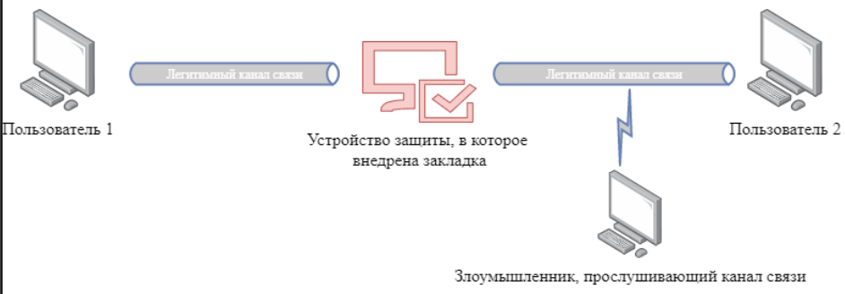
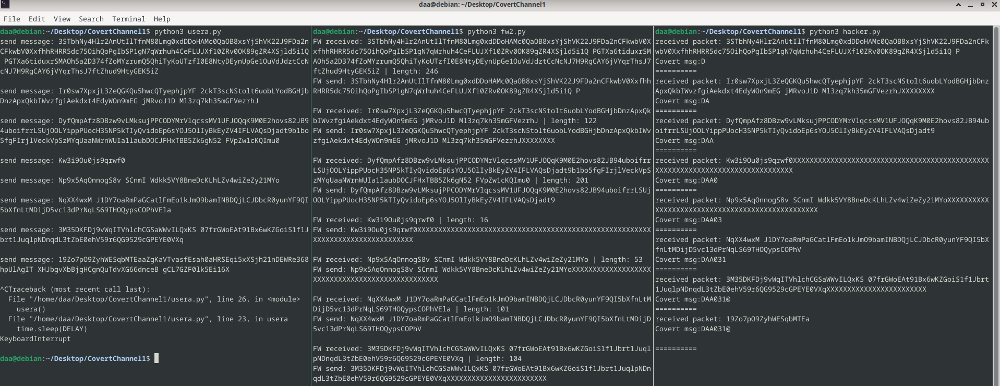

# Лабораторная работа №1. Способы построения скрытых каналов.

> Дан Андрей 
Б21-515
> 

# Задание

## Модель 4. Пакеты случайной длины передаются в случайные моменты времени.

## Пример 5. Скрытый канал, основанный на изменении длин
передаваемых пакетов

Пусть $L$ — максимальная длина пакета в битах. Предлагается разбить отрезок $[1, 𝐿]$ на
$𝐿/𝑛$ диапазонов, где $𝑛$ — параметр скрытого канала, $𝑛|𝐿$. Пусть нарушитель имеет алфавит из  $L / n$  символов, тогда для отправки символа с номером $𝑖$  злоумышленник посылает пакет, длина $𝑙$ которого удовлетворяет неравенству $(𝑖 − 1)𝑛 < 𝑙 ≤ 𝑖𝑛$.

## Возможности закладки: модификация трафика

# Выполнение

В ходе выполнения работы было написано четыре программы на python для имитации взаимодействия устройства по схеме



В программе usera.py создается легитимный канал связи (сокет 127.0.0.1:5004) и передается пакет случайным содержимым и долины не более заданной 

```jsx
import socket
import threading
import time
import random
import string

IP = '127.0.0.1'
PORT = 5004
DELAY = 1
MAX_LENGTH = 256 

def generate_random_message(max_length):
    length = random.randint(1, max_length)
    return ''.join(random.choices(string.ascii_letters + string.digits + ' ', k=length))

def usera():
    while True:
        with socket.socket(socket.AF_INET, socket.SOCK_STREAM) as s:
            s.connect((IP, PORT))
            message = generate_random_message(MAX_LENGTH)
            print(f'send message: {message}\n')
            s.sendall(message.encode())
        time.sleep(DELAY)

if __name__ == "__main__":
    usera()

```

Программа fw2.py имитирует СЗИ, при этом изменяя длину выходящих сообщений в зависимости от символа, который необходимо передать по скрытому каналу. 

```jsx
import socket
import threading
import time

import random
import string

IP = '127.0.0.1'
PORTA = 5004
PORTB = 6004
MSG = 'DAA031@\n'
DELAY = 2
N = 2

def calculate_range(char, n):
    ascii_code = ord(char)
    lower_bound = (ascii_code - 1) * N
    upper_bound = ascii_code * n
    return lower_bound, upper_bound

def send(data):
    with socket.socket(socket.AF_INET, socket.SOCK_STREAM) as s_fw_to_b:
        print(f"FW send: {data}\n")
        s_fw_to_b.connect((IP, PORTB))
        s_fw_to_b.sendall(data.encode())

def fw(msg):
    with socket.socket(socket.AF_INET, socket.SOCK_STREAM) as s_fw:
        s_fw.bind((IP, PORTA))
        s_fw.listen()
        while True:
            conn, _ = s_fw.accept()
            with conn:
                packet = conn.recv(1024).decode()
                length = len(packet)
                print(f"FW received: {packet} | length: {length}")
                while True:
                    if not msg:
                        break 

                    symbol = msg.pop(0) 
                    lower, upper = calculate_range(symbol, N)  
                    if lower < length <= upper:
                        send(packet) 
                        break 

                    elif length < lower:
                        packet = packet + "X" * (upper - length)
                        #packet = packet + ''.join(random.choices(string.ascii_letters + string.digits, k=(upper - length)))
                        send(packet)
                        break  

                    else:
                        send(packet[:upper])
                        packet = packet[-(length - upper):]
                        break 
if __name__ == "__main__":
    msg = list(MSG)
    fw(msg)

```

Программа hacker.py имитирует злоумышленника, который слушает канал связи

```jsx
import socket
import threading
import time

IP = '127.0.0.1'
PORTB = 6004
N = 2

def hacker(data):
    with socket.socket(socket.AF_INET, socket.SOCK_STREAM) as s_b:
        s_b.bind((IP, PORTB))
        s_b.listen()
        while True:
            conn, _ = s_b.accept()
            with conn:
                packet = conn.recv(1024).decode()
                code_ascii = len(packet) // N  
                if code_ascii == 9:
                    print("Message was delivered")
                    return
                # print(f"{chr(code_ascii)} | {len(packet)}")
                data += chr(code_ascii)
                print(f'received packet: {packet}\nCovert msg:{data}\n==========')

if __name__ == "__main__":
    data = ''
    hacker(data)
```

Программа userb.py имитирует легитимного пользователя userb, для которого usera передавал сообщение через СЗИ

```jsx
import socket
import threading
import time

IP = '127.0.0.1'
PORTB = 6003

def userb():
    with socket.socket(socket.AF_INET, socket.SOCK_DGRAM) as s_b:
        s_b.bind((IP, PORTB))
        while True:
            data, _ = s_b.recvfrom(1024)
            print(f"UserB received: {data} with len {len(data)}")

if __name__ == "__main__":
    userb()
```

В результате получили возможность передавать сообщения через скрытый канал связи:

